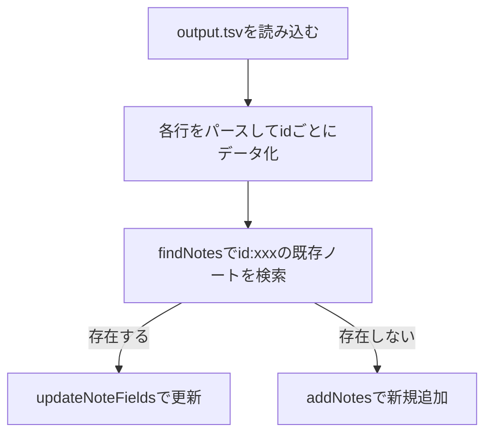

# Anki-Connect経由でoutput.tsvをupsert（重複時は更新、なければ追加）する計画

## 1. 前提・要件整理

- **TSVのカラム順**:  
  1. id  
  2. title  
  3. lines  
  4. url  
  5. tags

- **Anki側の設定**:  
  - デッキ名: `QA on scrapbox`
  - ノートタイプ: `QA on scrapbox`
  - フィールド名: `id`, `title`, `lines`, `url`, `tags`

---

## 2. upsert処理の全体像



---

## 3. 実装方針

### 3.1. スクリプトの流れ

1. `output.tsv`をUTF-8で読み込む
2. 各行をタブ区切りで分割し、idごとにデータを用意
3. 各idについてAnki-ConnectのfindNotesで既存ノートを検索（例: `"id:xxx"`）
4. 既存ノートがあればupdateNoteFieldsで更新、なければaddNotesで追加
5. レスポンスを確認し、エラーがあれば表示

### 3.2. Anki-Connect API例

#### findNotes

```json
{
  "action": "findNotes",
  "version": 6,
  "params": {
    "query": "id:xxx"
  }
}
```

#### updateNoteFields

```json
{
  "action": "updateNoteFields",
  "version": 6,
  "params": {
    "note": {
      "id": 1234567890,
      "fields": {
        "id": "xxx",
        "title": "yyy",
        "lines": "zzz",
        "url": "uuu",
        "tags": "tag1 tag2"
      }
    }
  }
}
```

#### addNotes

```json
{
  "action": "addNotes",
  "version": 6,
  "params": {
    "notes": [
      {
        "deckName": "QA on scrapbox",
        "modelName": "QA on scrapbox",
        "fields": {
          "id": "xxx",
          "title": "yyy",
          "lines": "zzz",
          "url": "uuu",
          "tags": "tag1 tag2"
        },
        "tags": ["tag1", "tag2"]
      }
    ]
  }
}
```

---

## 4. 注意点・補足

- findNotesのクエリは「id:xxx」形式（フィールド検索）で行う
- updateNoteFieldsにはAnki内部ノートID（note id）が必要なので、notesInfoで取得する場合もある
- 一度に大量のリクエストを送る場合はAPI制限やパフォーマンスに注意
- フィールド名・ノートタイプが完全一致していることを事前にAnkiで確認

---

## 5. 実装イメージ（Pythonスクリプト案・擬似コード）

```python
import csv
import requests

def find_note_id(field_id):
    payload = {
        "action": "findNotes",
        "version": 6,
        "params": {"query": f"id:{field_id}"}
    }
    r = requests.post("http://localhost:8765", json=payload)
    return r.json()["result"]

def update_note(note_id, fields):
    payload = {
        "action": "updateNoteFields",
        "version": 6,
        "params": {"note": {"id": note_id, "fields": fields}}
    }
    r = requests.post("http://localhost:8765", json=payload)
    return r.json()

def add_note(fields, tags):
    payload = {
        "action": "addNotes",
        "version": 6,
        "params": {"notes": [{
            "deckName": "QA on scrapbox",
            "modelName": "QA on scrapbox",
            "fields": fields,
            "tags": tags
        }]}
    }
    r = requests.post("http://localhost:8765", json=payload)
    return r.json()

with open("output.tsv", encoding="utf-8") as f:
    reader = csv.reader(f, delimiter="\t")
    for row in reader:
        if len(row) != 5:
            continue
        id_, title, lines, url, tags_str = row
        fields = {
            "id": id_,
            "title": title,
            "lines": lines,
            "url": url,
            "tags": tags_str
        }
        tags = tags_str.split() if tags_str else []
        note_ids = find_note_id(id_)
        if note_ids:
            update_note(note_ids[0], fields)
        else:
            add_note(fields, tags)
```

---